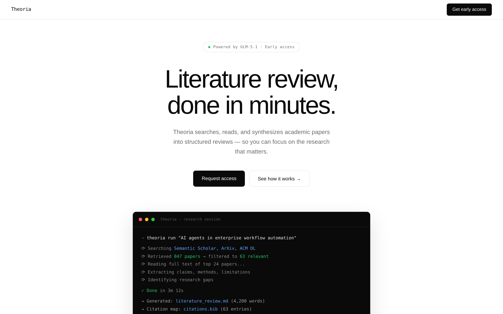

# Theoria

> **The research partner that thinks with you.**

Theoria 是面向学术研究者的 AI 科研伙伴。自然语言驱动，覆盖从文献综述到投稿的全科研流程——越用越懂你的研究方向、思维习惯和偏好期刊。

不是更强的搜索引擎，是更懂你的研究伙伴。

> 点击上方图片访问官网 → **<https://duck-ai-yy.github.io/theoria/>**

---

## About

Theoria 是为欧洲学术圈 PhD 学生打造的 AI 科研伙伴，从文献综述切入，覆盖全科研流程。
官网：<https://duck-ai-yy.github.io/theoria/>

---

## 定位

| 维度 | 说明 |
| --- | --- |
| **目标用户** | 欧洲英文学术圈的 PhD 学生 |
| **切入点** | 文献综述自动化 |
| **核心差异化** | 跨会话记忆 + 个性化适配——不是更强的搜索，是更懂你的伙伴 |

---

## 它能做什么

- **文献检索与筛选**：用自然语言描述研究问题，自动从 Semantic Scholar、OpenAlex、arXiv 等数据源拉取相关文献，按相关性、时效性、引用数过滤。
- **全文阅读与抽取**：阅读 Top 论文全文，抽取核心论点、方法、数据集、局限与关键发现。
- **结构化综述生成**：将散落的发现组织成结构化叙事，浮现矛盾、共识与开放研究空白。
- **可编辑输出**：导出 Markdown 综述、`.bib` 引用文件、可视化引文图谱，可直接粘贴进 Notion、Obsidian、Overleaf。
- **来源透明**：每个论点都链接回原始论文。无幻觉引用，输出到来源全程可追溯。

---

## 核心差异化：越用越懂你

Theoria 的关键不在于搜索更广，而在于**跨会话记忆**：

- 记住你的研究方向与子领域聚焦
- 学习你常引用的作者、偏好的期刊与会议
- 适配你的综述写作风格与思维结构
- 累积你对相关性的判断标准

每一次使用，它都更精确地像你一样思考。

---

## 技术栈

| 层 | 选型 | 说明 |
| --- | --- | --- |
| **数据层** | Semantic Scholar + OpenAlex + arXiv | 开放学术数据，零成本接入 |
| **模型层** | GLM-5.1 | 通过 Z.ai Startup Program 申请 credits |
| **交互层** | 自然语言 CLI / Web | 长程任务自主执行 |

---

## 路线图

- [x] 文献综述 MVP
- [ ] 跨会话记忆与偏好学习
- [ ] 引文图谱可视化
- [ ] 投稿期刊推荐与格式适配
- [ ] 写作辅助（论文章节起草、论证润色）
- [ ] 全科研流程闭环（idea → 综述 → 实验记录 → 投稿）

---

## 状态

Early access · Beta 期间免费 · Built with GLM-5.1 · Munich, 2026
